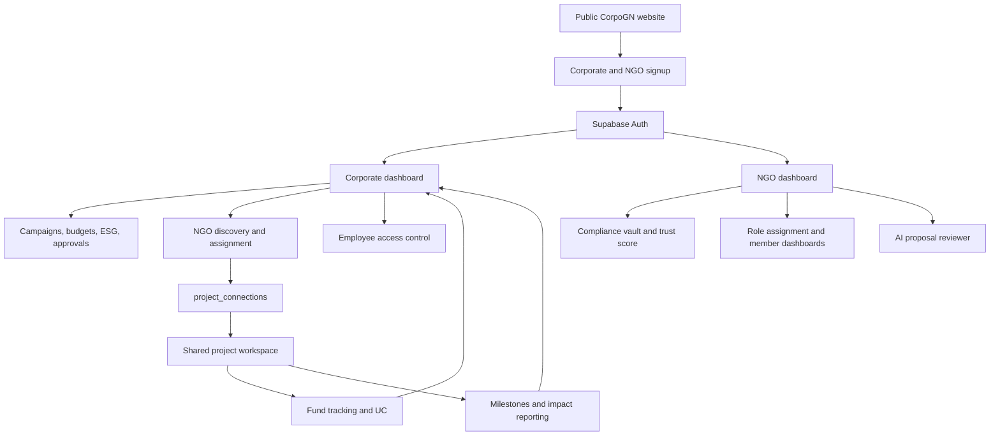
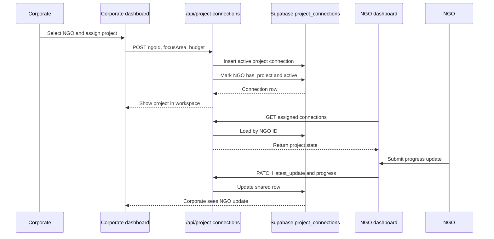
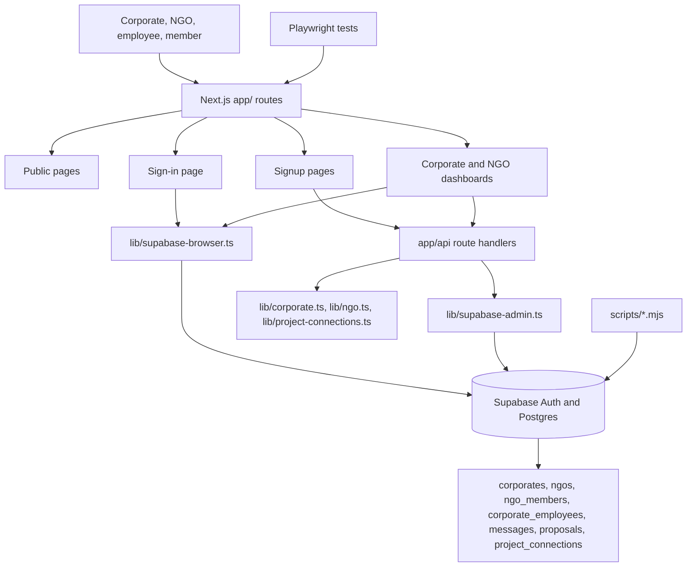

# CorpoGN

> CSR collaboration infrastructure for corporates, NGOs, compliance teams, field teams, and impact reporting.

[](https://nextjs.org/)
[](https://react.dev/)
[](https://www.typescriptlang.org/)
[](https://supabase.com/)
[](https://playwright.dev/)

CorpoGN is a full-stack CSR and NGO partnership platform that connects corporate CSR teams with verified NGO partners through a shared operating workspace. Corporates can manage CSR campaigns, discover NGOs, assign projects, track budgets, monitor ESG outcomes, approve reports, and govern employee access. NGOs get a role-aware command center for compliance, proposals, team operations, fund tracking, milestone reporting, utilization certificates, and impact reporting.

For investors, CorpoGN is positioned as infrastructure for the CSR accountability layer: it turns fragmented CSR execution into a measurable, auditable, multi-stakeholder workflow. The product connects the money side, the implementation side, and the reporting side in one system, with AI-assisted proposal review and role-based operations built into the platform.

## 🔗 Live links

| Link | URL | Notes |
| --- | --- | --- |
| GitHub repository shared for review | [github.com/HAWKAARJAV/CORPOGN](https://github.com/HAWKAARJAV/CORPOGN) | Repository URL provided for this README update. |
| Local git remote in this workspace | [github.com/HAWKAARJAV/CORPOGN-FINAL](https://github.com/HAWKAARJAV/CORPOGN-FINAL) | Current `origin` remote from `git remote -v`. |
| Local app | `http://localhost:3000` | Available after `npm run dev`. |
| Sign in | `http://localhost:3000/signin` | Corporate, corporate employee, NGO admin, and NGO member login. |
| Corporate signup | `http://localhost:3000/signup/corporate` | Corporate registration flow. |
| NGO signup | `http://localhost:3000/signup/ngo` | NGO registration flow. |
| Platform page | `http://localhost:3000/corpogn-platform` | Public platform overview. |
| CSR strategy page | `http://localhost:3000/csr-strategy` | Public CSR strategy content. |
| CSR impact assessment page | `http://localhost:3000/csr-impact-assessment` | Public impact assessment content. |

No production deployment URL is declared in the local project files. The app is fully runnable locally through the Next.js dev server.

## 💼 Investor snapshot

| Area | Investor takeaway |
| --- | --- |
| Problem | CSR programs often split discovery, compliance, project execution, fund utilization, and impact evidence across disconnected tools. |
| Solution | CorpoGN provides a shared CSR workspace where corporates and NGOs operate on the same project records, reporting states, and evidence workflows. |
| Users | Corporate CSR teams, CSR finance teams, ESG/compliance teams, NGO admins, NGO finance officers, compliance officers, operations teams, field teams, reporting teams, and volunteers. |
| Product depth | Public website, onboarding, authenticated dashboards, role-based access, shared project connections, messages, proposal review, fund tracking, UC reporting, impact reporting, and tests. |
| Data layer | Supabase Auth and Postgres tables for corporates, NGOs, employees, members, messages, proposals, and project connections. |
| AI layer | Optional OpenRouter/Gemini proposal analysis with local rule-based fallback when AI keys are absent. |
| Execution readiness | Existing schema files, seed scripts, demo credentials, API routes, and Playwright coverage for major flows. |

## ✨ What CorpoGN does

- Helps corporates discover and manage NGO partners.
- Gives NGOs a structured workspace for compliance, proposals, delivery, reporting, and team roles.
- Creates shared project records between corporates and NGOs through `project_connections`.
- Tracks CSR project progress, milestones, latest NGO updates, document requests, utilization certificate status, and impact report status.
- Supports corporate employee page-level permissions.
- Supports NGO member role dashboards for finance, compliance, operations, field coordination, reporting, and volunteer work.
- Provides AI-assisted CSR proposal analysis through `/api/analyse-proposal`.
- Gives investors and stakeholders a clear story: CSR capital, project delivery, and impact evidence become traceable in one system.

## 🧭 Product map



## 🧩 Key product modules

### Corporate command center

Corporate users get a CSR operations dashboard at `/corporate/[slug]/dashboard`. New corporate accounts are initially locked to Support / Chat, and sending a support message activates wider dashboard access.

| Module | Purpose |
| --- | --- |
| Dashboard | CSR budget, released funds, utilization, pending approvals, campaign board, and priority signals. |
| Master Analytics | Portfolio-level CSR performance, ESG index, fund efficiency, NGO success rate, and risk scoring. |
| Campaign Management | Campaign status, progress, budgets, locations, deadlines, and lifecycle tracking. |
| NGO Management | NGO discovery, verification status, focus areas, ratings, trust scores, and project assignment. |
| Project Workspace | Shared corporate-NGO project state from `project_connections`. |
| Budget & Fund Tracking | CSR budget allocation, tranche releases, utilization, balances, and finance review queues. |
| ESG & Impact | SDG alignment, beneficiary reach, outcome metrics, and impact reporting. |
| Reports & Approvals | Approval queues for funds, proposals, reports, compliance documents, and campaign actions. |
| AI Insights | Recommendations, risk flags, partner signals, and portfolio insights. |
| Audit & Compliance | Governance tracking, document status, compliance health, and audit trails. |
| Employees & Access | Employee creation and page-level access controls. |
| Notifications | Workspace updates and activity alerts. |
| Support / Chat | Activation channel and support conversation area. |

### NGO command center

NGO users get a dashboard at `/ngo/[slug]/dashboard`. Super admins can manage profile, compliance, proposal review, role assignment, and project reporting. Member dashboards are filtered by role.

| Role | Base access | Project-unlocked access |
| --- | --- | --- |
| NGO Super Admin | Command Center, NGO Profile, Compliance Vault, Trust Score, AI Proposal Reviewer, Role Assignment, Settings | My Projects, Project Chat, Fund Tracking, Milestone Reporting, Impact Reporting, Utilization Certificate |
| Finance Officer | Fund Tracking, Finance Analytics, Invoices, Utilization Reports, Grant Tracking | Fund Tracking, Utilization Certificate |
| Compliance Officer | Compliance Vault, Audit Requests, NGO Verification, Compliance Workflow | Utilization Certificate |
| Operations Manager | My Projects, Milestones, Beneficiary Tracking, Task Assignment, Report Drafts | My Projects, Milestone Reporting |
| Field Coordinator | Assigned Projects, Beneficiary Forms, Media Uploads, Attendance | My Projects, Milestone Reporting |
| Reporting Executive | Impact Reports, Media Library, Analytics View, Presentations | Impact Reporting |
| Volunteer | Assigned Tasks, Event Participation, Uploads | No additional project-only sections |

## 🧠 Core systems

### 1. Shared project connection engine

The heart of the product is the `project_connections` flow. A corporate assigns a project to an NGO. That creates a shared project record. The NGO then uses that record to post updates, progress, milestone state, utilization certificate state, and impact reporting state. The corporate dashboard reads the same record back into its Project Workspace.



### 2. Role and access engine

CorpoGN uses Supabase Auth metadata and database records to route users into the correct workspace.

```mermaid
flowchart TD
    SignIn[/signin] --> Auth[Supabase signInWithPassword]
    Auth --> Metadata{account_type}
    Metadata -->|corporate| CorpAdmin[Corporate admin dashboard]
    Metadata -->|corporate_employee| CorpEmployee[Corporate employee dashboard]
    Metadata -->|ngo| NgoAdmin[NGO super-admin dashboard]
    Metadata -->|ngo_member| NgoMember[Role-based NGO member dashboard]
    CorpEmployee --> Allowed[Filter by allowed_pages]
    NgoMember --> Role[Filter by NGO role]
    Role --> ProjectUnlock{NGO has active project?}
    ProjectUnlock -->|Yes| AddProjectItems[Add project sections]
    ProjectUnlock -->|No| BaseOnly[Show base role sections]
```

### 3. AI proposal reviewer

The proposal reviewer endpoint is `POST /api/analyse-proposal`. It helps NGOs assess CSR proposal quality against Schedule VII alignment, impact metrics, budget justification, geographic targeting, and beneficiary targeting.

The route supports three modes:

| Mode | Trigger | Model or behavior |
| --- | --- | --- |
| OpenRouter | `OPENROUTER_API_KEY` exists | `google/gemini-2.5-flash` |
| Google Gemini | `GEMINI_API_KEY` exists | `gemini-1.5-flash` |
| Local fallback | No AI key or AI call fails | Rule-based CSR proposal analysis |

```mermaid
flowchart TD
    Text[Proposal text] --> Endpoint[/api/analyse-proposal]
    Endpoint --> AuthCheck{Bearer token valid?}
    AuthCheck -- No --> Unauthorized[401 Unauthorized]
    AuthCheck -- Yes --> TextCheck{Text present?}
    TextCheck -- No --> BadRequest[400 Proposal text is required]
    TextCheck -- Yes --> OpenRouter{OPENROUTER_API_KEY?}
    OpenRouter -- Yes --> OR[OpenRouter Gemini 2.5 Flash]
    OpenRouter -- No --> Gemini{GEMINI_API_KEY?}
    Gemini -- Yes --> G[Google Gemini 1.5 Flash]
    Gemini -- No --> Local[Local proposal analysis]
    OR --> Result[CSR analysis result]
    G --> Result
    Local --> Result
```

## 🏗️ Architecture

CorpoGN is a Next.js 16 App Router application. Public routes, dashboard routes, and server route handlers live under `app/`. Shared domain rules and Supabase clients live under `lib/`. Static media and exported HTML reference pages live under `public/`. Supabase schema files live at the repository root.



## 🛠️ Tech stack

| Layer | Technology | Why this matters |
| --- | --- | --- |
| Framework | Next.js `16.2.6` App Router | Combines public pages, dashboards, and API route handlers in one production-ready app. |
| UI | React `19.2.4` | Supports rich interactive dashboards, forms, modals, navigation, and role-based panels. |
| Language | TypeScript `5` | Keeps API contracts, project connection models, and role definitions safer as the app grows. |
| Styling | Tailwind CSS `4` | Fast dashboard styling with responsive layouts and dense operational UI. |
| Icons | `lucide-react` | Consistent iconography across dashboard navigation and actions. |
| Auth | Supabase Auth | Login, account metadata, corporate admins, NGO admins, employees, and NGO members. |
| Database | Supabase Postgres | Stores organizations, members, employees, messages, proposals, and project connections. |
| Server data access | `@supabase/supabase-js` | Service-role route handlers for privileged operations like creating users. |
| Browser data access | `@supabase/ssr` | Client-side sign-in and browser reads through `lib/supabase-browser.ts`. |
| AI | OpenRouter and Gemini | Optional CSR proposal review through external AI models with local fallback. |
| Testing | Playwright `1.60.0` | End-to-end coverage for sign-in, dashboards, locked states, uploads, roles, and cross-workspace flows. |
| Linting | ESLint `9` | Static checks for the Next.js and TypeScript codebase. |

## 🚀 Getting started

### Prerequisites

- Node.js `>=20.0.0`
- npm with the committed `package-lock.json`
- Supabase project with Auth enabled
- SQL from `supabase-schema.sql` applied
- SQL from `supabase-production-migration.sql` applied for project/reporting fields
- Playwright browser binaries for end-to-end tests

### Installation

1. Install dependencies.

   ```bash
   npm install
   ```

2. Create `.env.local` in the repository root.

3. Add the required Supabase variables listed in the configuration table.

4. Apply the database schema files in Supabase.

   ```text
   supabase-schema.sql
   supabase-production-migration.sql
   ```

5. Start the app.

   ```bash
   npm run dev
   ```

6. Open the local app.

   ```text
   http://localhost:3000
   ```

### Configuration

| Name | Required | Used by | Purpose |
| --- | --- | --- | --- |
| `NEXT_PUBLIC_SUPABASE_URL` | Yes | Browser client, server client, scripts | Supabase project URL. |
| `NEXT_PUBLIC_SUPABASE_ANON_KEY` | Yes | `lib/supabase-browser.ts` | Public browser auth key. |
| `SUPABASE_SERVICE_ROLE_KEY` | Yes | `lib/supabase-admin.ts`, scripts | Server-only privileged key for creating Auth users and writing admin records. |
| `OPENROUTER_API_KEY` | Optional | `app/api/analyse-proposal/route.ts` | Enables OpenRouter Gemini proposal analysis. |
| `GEMINI_API_KEY` | Optional | `app/api/analyse-proposal/route.ts` | Enables Google Gemini proposal analysis. |
| `.env.local` | Yes | Next.js and scripts | Local secret/config file. |

Do not commit `.env.local`. The app still returns local rule-based proposal analysis when `OPENROUTER_API_KEY` and `GEMINI_API_KEY` are absent.

## 🔐 Demo access

The sign-in page includes demo shortcuts in `app/signin/page.tsx`.

| Account | Email | Password | Workspace |
| --- | --- | --- | --- |
| Corporate Super Admin | `demo@corpdemo.com` | `CorpoGN@2026` | Corporate dashboard |
| NGO Super Admin | `admin@greenearthngo.in` | `GreenEarth@2026` | NGO dashboard |
| Finance Officer | `finance@greenearthngo.in` | `Finance@2026` | NGO member dashboard |
| Compliance Officer | `compliance@greenearthngo.in` | `Comply@2026` | NGO member dashboard |
| Operations Manager | `ops@greenearthngo.in` | `Ops@2026` | NGO member dashboard |
| Field Coordinator | `field@greenearthngo.in` | `Field@2026` | NGO member dashboard |
| Reporting Executive | `reporter@greenearthngo.in` | `Report@2026` | NGO member dashboard |
| Volunteer | `volunteer@greenearthngo.in` | `Volunteer@2026` | NGO member dashboard |

## 📖 Usage examples

### Register a corporate account

`POST /api/corporates/register` accepts multipart form data and creates a Supabase Auth user plus a `corporates` row.

```bash
curl -X POST http://localhost:3000/api/corporates/register \
  -F "companyName=Test Corporation 2026" \
  -F "companyEmail=csr-admin-2026@testcorp.example" \
  -F "workEmail=csr-admin-2026@testcorp.example" \
  -F "password=TestCorp@2026!" \
  -F "confirmPassword=TestCorp@2026!" \
  -F "industryType=Technology" \
  -F "state=Maharashtra" \
  -F "country=India" \
  -F "csrFocusAreas=Education"
```

Successful response:

```json
{
  "slug": "test-corporation-2026"
}
```

### Register an NGO account

`POST /api/ngos/register` accepts multipart form data and creates a Supabase Auth user plus an `ngos` row.

```bash
curl -X POST http://localhost:3000/api/ngos/register \
  -F "ngoName=Green Skills Trust 2026" \
  -F "officialNgoEmail=admin-2026@greenskills.example" \
  -F "workEmail=admin-2026@greenskills.example" \
  -F "password=GreenSkills@2026!" \
  -F "confirmPassword=GreenSkills@2026!" \
  -F "focusArea=Education" \
  -F "state=Karnataka"
```

Successful response:

```json
{
  "slug": "green-skills-trust-2026"
}
```

### Analyze a CSR proposal from the app

`POST /api/analyse-proposal` requires a signed-in Supabase user token. This example mirrors the browser client pattern used by the app.

```ts
import { supabaseBrowser } from "@/lib/supabase-browser";

const { data } = await supabaseBrowser.auth.getSession();

const response = await fetch("/api/analyse-proposal", {
  method: "POST",
  headers: {
    Authorization: `Bearer ${data.session?.access_token}`,
    "Content-Type": "application/json",
  },
  body: JSON.stringify({
    text: "We will educate 500 rural children in Maharashtra with a budget of Rs 25 lakh, district-level school partners, attendance KPIs, and quarterly learning outcome reports.",
  }),
});

const result = await response.json();
```

## 🧾 API surface

| Route | Methods | Purpose |
| --- | --- | --- |
| `/api/corporates/register` | `POST` | Create corporate Auth user and `corporates` row. |
| `/api/corporates/employees` | `GET`, `POST` | List and create corporate employee accounts with page permissions. |
| `/api/corporates/messages` | `POST` | Save corporate support messages and activate locked corporate access. |
| `/api/ngos/register` | `POST` | Create NGO Auth user and `ngos` row. |
| `/api/ngos/members` | `GET`, `POST` | List and create NGO member accounts with role metadata. |
| `/api/ngo/profile` | `PATCH` | Update NGO profile fields. |
| `/api/ngo/opportunities` | `GET` | Return NGO opportunity data. |
| `/api/ngo/funders` | `GET` | Return corporate funder data. |
| `/api/ngo/proposals` | `GET`, `POST` | List and create NGO proposals. |
| `/api/ngo/messages` | `GET`, `POST` | Read and create NGO messages. |
| `/api/project-connections` | `GET`, `POST`, `PATCH` | Load, create, and update shared corporate-NGO project connections. |
| `/api/project-connections/[id]` | `GET`, `PATCH` | Read or update a specific project connection. |
| `/api/project-connections/[id]/uc` | `GET`, `POST` | Read or submit utilization certificate state. |
| `/api/project-connections/[id]/impact-report` | `GET`, `POST` | Read or submit impact report state. |
| `/api/analyse-proposal` | `POST` | Analyze proposal quality through OpenRouter, Gemini, or local fallback. |

## 🗂️ Project structure

```text
.
|-- app/                                      Next.js App Router pages, dashboards, and API routes.
|   |-- api/                                  Route handlers for auth-adjacent workflows, AI, messages, projects, and reports.
|   |-- corporate/[slug]/dashboard/           Corporate dashboard route and UI.
|   |-- ngo/[slug]/dashboard/                 NGO dashboard route and UI.
|   |-- signup/                               Signup chooser plus corporate and NGO onboarding.
|   |-- signin/page.tsx                       Account-type-aware Supabase sign-in page.
|   |-- landing-frame.tsx                     Shared frame for imported public HTML pages.
|   |-- corpogn-content.tsx                   Landing and platform content.
|   |-- layout.tsx                            Root layout.
|   `-- globals.css                           Global Tailwind styles.
|-- lib/                                      Shared clients, roles, permissions, and domain helpers.
|   |-- corporate.ts                          Corporate sidebar and slug helpers.
|   |-- ngo.ts                                NGO roles, permissions, and unlock helpers.
|   |-- project-connections.ts                Project connection types, defaults, mapping, and naming.
|   |-- supabase-admin.ts                     Server-side Supabase service-role client.
|   `-- supabase-browser.ts                   Browser Supabase client.
|-- public/                                   Static images, screenshots, SVGs, and exported HTML references.
|-- scripts/                                  Seed and asset utility scripts.
|   |-- seed-corporate-employees.mjs          Seeds corporate employees for `corporate-giant`.
|   |-- seed-ngo-test-data.mjs                Seeds NGO demo/test data.
|   |-- seed-project-connection.mjs           Seeds shared project connection data.
|   `-- generate-feature-svgs.mjs             Generates feature SVG assets.
|-- tests/                                    Playwright end-to-end specs.
|-- playwright/global-setup.ts                Creates and reuses NGO auth storage states.
|-- playwright.config.ts                      Playwright projects, web server, retries, screenshots, and reports.
|-- supabase-schema.sql                       Base Supabase schema.
|-- supabase-production-migration.sql         Production migration for project/reporting fields.
|-- next.config.ts                            Next.js configuration.
|-- package.json                              Scripts, dependencies, and Node engine.
`-- tsconfig.json                             TypeScript configuration.
```

## 🧪 Testing

Run linting:

```bash
npm run lint
```

Run the Playwright suite:

```bash
npx playwright test
```

`playwright.config.ts` starts or reuses `npm run dev` at `http://localhost:3000`, runs tests sequentially to reduce Supabase Auth rate-limit pressure, retries once, captures screenshots only on failure, and retains video on failure.

Current test coverage includes:

- Corporate sign-in, account-type mismatch handling, locked dashboard state, support chat, unlock behavior, dashboard navigation, KPI content, breadcrumb changes, and corporate signup UI.
- NGO sign-in, dashboard navigation, quick actions, compliance vault uploads, profile editing, trust score, AI proposal reviewer, role assignment, member loading, milestone locked state, and sign-out.
- Role dashboards for NGO members.
- Corporate dashboard behavior through a separate Playwright project.
- Global setup that signs in Green Earth Foundation NGO demo accounts and stores auth state under `playwright/.auth/`.

## 📦 Available scripts

| Command | Purpose |
| --- | --- |
| `npm run dev` | Start the Next.js development server. |
| `npm run build` | Build the production app. |
| `npm run start` | Start the production server after a build. |
| `npm run lint` | Run ESLint. |
| `npm run seed:corporate-employees` | Seed corporate employee Auth users and rows for `corporate-giant`. |
| `npx playwright test` | Run the Playwright end-to-end suite. |

Additional scripts:

- `scripts/seed-ngo-test-data.mjs`
- `scripts/seed-project-connection.mjs`
- `scripts/generate-feature-svgs.mjs`

## 📈 Roadmap for investor-facing polish

- Add a production deployment URL to this README once hosted.
- Add screenshots or GIFs from `public/ss-corporate-dashboard.png`, `public/ss-ngo-dashboard.png`, and `public/ss-campaign-management.png`.
- Add a short product demo video link.
- Add anonymized sample CSR outcomes and reporting dashboards.
- Add a pricing or GTM section when the commercial model is finalized.
- Add security notes for Supabase RLS, audit logging, and service-role key handling.

## 🤝 Contributing

1. Fork the repository.
2. Create a feature branch.
3. Install dependencies with `npm install`.
4. Keep changes aligned with the existing Next.js App Router, Supabase, and role-permission patterns.
5. Run `npm run lint`.
6. Run `npx playwright test` for dashboard, auth, role, or API-facing changes.
7. Open a pull request with a concise description, screenshots for UI changes, and test results.

This repository uses Next.js `16.2.6`. Before changing framework-specific code, read the relevant local guide under `node_modules/next/dist/docs/`, because this version may differ from older Next.js conventions.

## 📄 License

No license file or `license` field is currently declared in this repository.
