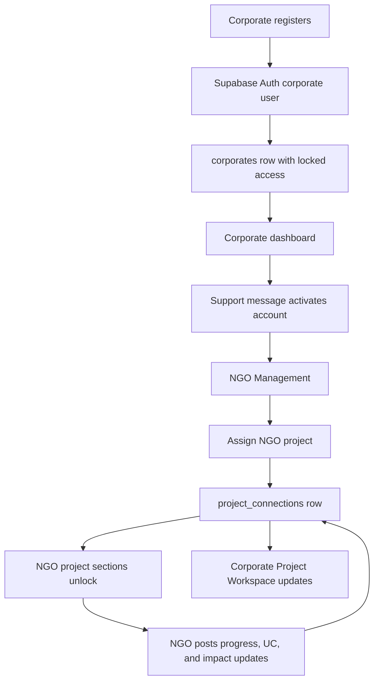
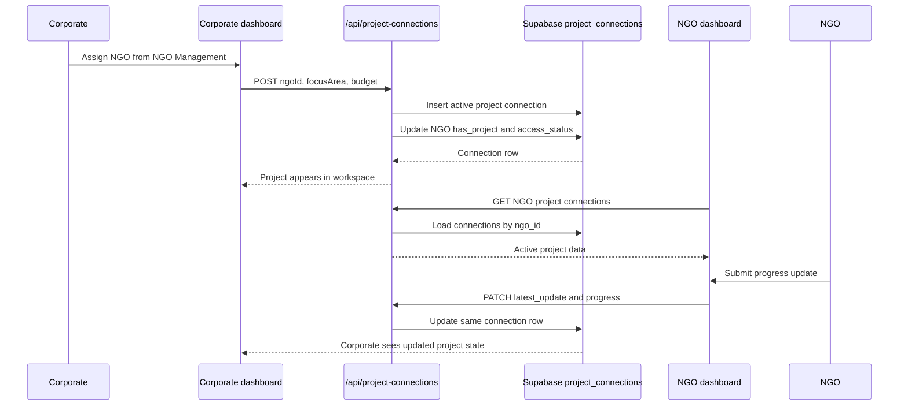
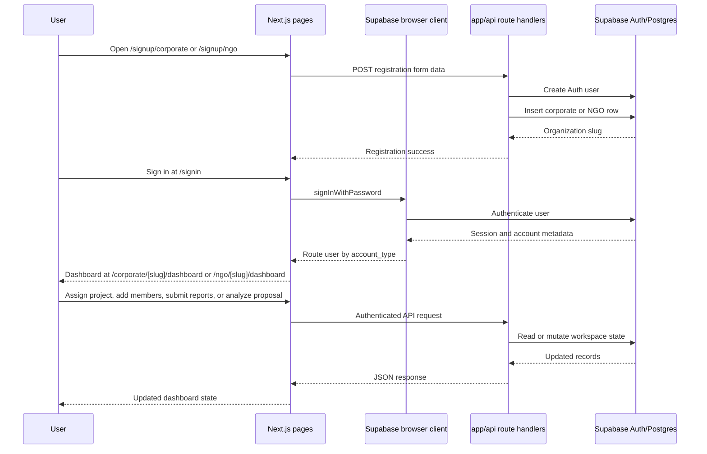

# CorpOgn

CSR collaboration infrastructure for corporates, NGOs, role-based teams, project delivery, compliance, and impact reporting.

CorpOgn is a full-stack CSR and NGO partnership platform built with Next.js, React, TypeScript, Tailwind CSS, Supabase, and Playwright. It gives corporate CSR teams a workspace to manage campaigns, discover NGOs, assign projects, track budgets, review impact, and govern employee access, while giving NGOs a role-aware dashboard for compliance, proposals, team operations, utilization certificates, milestone reporting, and shared project updates.

The platform is designed for two sides of the same CSR workflow: corporates that need verifiable partner management and NGOs that need a clear operational system for funding, reporting, and accountability. The dashboards are connected through shared Supabase records, so a project assignment created by a corporate becomes live work for the NGO and returns progress signals back to the corporate workspace.

## ✨ Features

- Public CorpOgn website with landing, platform, services, CSR strategy, CSR impact assessment, about, blog, contact, and privacy policy routes.
- Corporate onboarding flow with Supabase Auth user creation, company slug generation, locked-first access, and dashboard routing at `/corporate/[slug]/dashboard`.
- NGO onboarding flow with Supabase Auth user creation, NGO slug generation, pending verification state, and dashboard routing at `/ngo/[slug]/dashboard`.
- Corporate CSR dashboard with analytics, campaigns, NGO management, project workspace, budget tracking, ESG impact, reports, approvals, audit, employees, notifications, and support chat.
- NGO super-admin dashboard with command center, profile, compliance vault, trust score, AI proposal reviewer, opportunities, funders, proposals, partnerships, project work, reporting, audit logs, role assignment, and settings.
- NGO member dashboards for finance officer, compliance officer, operations manager, field coordinator, reporting executive, and volunteer roles.
- Corporate employee access controls through page-level permissions backed by `corporate_employees` and Supabase user metadata.
- Shared `project_connections` workflow for corporate-to-NGO assignments, NGO progress updates, utilization certificate status, impact report status, and cross-dashboard project state.
- AI proposal analysis endpoint with OpenRouter, Gemini, and local rule-based fallback modes.
- Supabase-backed APIs for registrations, members, employees, messages, opportunities, funders, proposals, profile updates, project connections, utilization certificates, and impact reports.
- Seed scripts for corporate employees, NGO test data, project connections, and generated feature SVG assets.
- Playwright end-to-end tests for sign-in, locked access, dashboard navigation, compliance uploads, role assignment, corporate workflows, NGO workflows, and role-specific dashboards.

## 🔍 How it works

CorpOgn models CSR as a shared operating system. Corporate users register, sign in, and start in a restricted dashboard state where Support / Chat is available first. Once activated, corporate admins can manage CSR campaigns, discover verified or active NGOs, assign projects, invite employees, and track portfolio health.

NGO users register separately and enter an NGO dashboard where compliance, trust score, proposal review, and role assignment are available to super admins. Project-specific sections such as My Projects, Project Chat, Fund Tracking, Milestone Reporting, Impact Reporting, and Utilization Certificate unlock after the NGO receives an assigned project.

The most important connection is `project_connections`: a shared table that lets the corporate dashboard and NGO dashboard read and update the same CSR project record.



## 📁 Main workspaces

### Corporate workspace

The corporate dashboard is organized around the sidebar in `lib/corporate.ts`.

| Section | What it does |
| --- | --- |
| Dashboard | High-level CSR budget, released funds, utilization, pending approvals, campaign board, and priority signals. |
| Master Analytics | Portfolio-wide CSR performance, impact efficiency, NGO success rate, fund efficiency, ESG index, and risk score. |
| Campaign Management | Campaign lifecycle, budgets, status, locations, progress, and deadline tracking. |
| NGO Management | NGO discovery, verification filters, trust scores, focus areas, locations, ratings, and assignment actions. |
| Project Workspace | Shared corporate-NGO project records from `project_connections`. |
| Budget & Fund Tracking | CSR allocation, released funds, utilization, balances, and finance review queues. |
| ESG & Impact | Outcomes, ESG indicators, SDG alignment, beneficiary reach, and reporting visuals. |
| Reports & Approvals | Approval queues for funds, proposals, reports, compliance documents, and campaign actions. |
| AI Insights | Recommendations, risk flags, partner matching signals, and performance insights. |
| Audit & Compliance | Audit logs, compliance health, document expiry, and governance tracking. |
| Employees & Access | Corporate employee accounts with allowed dashboard pages. |
| Notifications | Platform alerts and activity updates. |
| Support / Chat | First-access channel for locked corporate accounts and ongoing support messages. |

### NGO workspace

The NGO dashboard uses role definitions and unlock rules from `lib/ngo.ts`.

| Role | Base access | Project-unlocked access |
| --- | --- | --- |
| NGO Super Admin | Command Center, NGO Profile, Compliance Vault, Trust Score, AI Proposal Reviewer, Role Assignment, Settings | My Projects, Project Chat, Fund Tracking, Milestone Reporting, Impact Reporting, Utilization Certificate |
| Finance Officer | Fund Tracking, Finance Analytics, Invoices, Utilization Reports, Grant Tracking | Fund Tracking, Utilization Certificate |
| Compliance Officer | Compliance Vault, Audit Requests, NGO Verification, Compliance Workflow | Utilization Certificate |
| Operations Manager | My Projects, Milestones, Beneficiary Tracking, Task Assignment, Report Drafts | My Projects, Milestone Reporting |
| Field Coordinator | Assigned Projects, Beneficiary Forms, Media Uploads, Attendance | My Projects, Milestone Reporting |
| Reporting Executive | Impact Reports, Media Library, Analytics View, Presentations | Impact Reporting |
| Volunteer | Assigned Tasks, Event Participation, Uploads | No additional project-only sections |

## 🧠 Core systems

### Project connection engine

The project connection engine lives in `app/api/project-connections/route.ts` and `lib/project-connections.ts`. Corporate accounts create assignments with `POST /api/project-connections`; corporate and NGO accounts load their side of the workspace with `GET /api/project-connections`; NGO accounts post progress with `PATCH /api/project-connections`.

Each connection maps core project fields such as project name, focus area, budget, status, progress, milestone, document requests, latest update, NGO progress notes, milestone status, beneficiary count, utilization certificate state, and impact report state.



### AI proposal reviewer

The AI proposal reviewer endpoint is `POST /api/analyse-proposal`. It requires a Supabase bearer token and proposal text. The route checks the signed-in user, validates text, then chooses the best available analysis mode:

1. `OPENROUTER_API_KEY` present: calls OpenRouter with `google/gemini-2.5-flash`.
2. `GEMINI_API_KEY` present: calls Google Gemini with `gemini-1.5-flash`.
3. No AI key present or AI call fails: returns local rule-based CSR proposal analysis.

The route does not expose keys to the browser. Keys belong in `.env.local` and are read only on the server.

```mermaid
flowchart TD
    A[NGO submits proposal text] --> B[/api/analyse-proposal]
    B --> C{Valid Supabase bearer token?}
    C -- No --> D[401 Unauthorized]
    C -- Yes --> E{Proposal text present?}
    E -- No --> F[400 Proposal text is required]
    E -- Yes --> G{OPENROUTER_API_KEY set?}
    G -- Yes --> H[OpenRouter google/gemini-2.5-flash]
    G -- No --> I{GEMINI_API_KEY set?}
    I -- Yes --> J[Google Gemini gemini-1.5-flash]
    I -- No --> K[Local rule-based analysis]
    H --> L[CSR proposal feedback]
    J --> L
    K --> L
```

### Access and unlock rules

- New corporate accounts are created with `access_status = "locked"` and initially stay in Support / Chat.
- Sending a corporate support message through `/api/corporates/messages` activates the corporate account.
- Corporate employee accounts use `allowed_pages` from `corporate_employees` or Auth metadata.
- NGO accounts start with `access_status = "pending"`, `has_project = false`, and `trust_score = 0`.
- NGO opportunities, funders, and proposal flows depend on verification or active status.
- NGO project sections depend on `has_project` or active project connections.
- NGO member dashboards are filtered by role first, then expanded by project unlocks.

## 🏗️ Architecture

This project uses the Next.js App Router. Public pages, dashboard pages, and API route handlers all live under `app/`. Shared Supabase clients and domain helpers live in `lib/`. Static assets and exported reference HTML files live in `public/`. Database setup is captured in `supabase-schema.sql` and `supabase-production-migration.sql`. Browser tests live in `tests/` with Playwright auth setup in `playwright/global-setup.ts`.

```mermaid
flowchart TD
    User[Corporate, NGO, employee, or member] --> App[Next.js app directory]
    App --> PublicRoutes[Public website routes]
    App --> Signup[Signup routes]
    App --> Signin[/signin]
    App --> Dashboards[Corporate and NGO dashboards]
    Signin --> BrowserClient[lib/supabase-browser.ts]
    Dashboards --> BrowserClient
    Dashboards --> Routes[app/api route handlers]
    Signup --> Routes
    Routes --> AdminClient[lib/supabase-admin.ts]
    Routes --> DomainLibs[lib/corporate.ts, lib/ngo.ts, lib/project-connections.ts]
    BrowserClient --> Supabase[(Supabase Auth and Postgres)]
    AdminClient --> Supabase
    Supabase --> Tables[corporates, ngos, ngo_members, corporate_employees, messages, project_connections]
    Scripts[scripts/*.mjs] --> Supabase
    Tests[Playwright tests] --> App
```

## 🛠️ Tech stack

| Layer | Technology | Why it is used here |
| --- | --- | --- |
| Framework | Next.js `16.2.6` App Router | Routes, layouts, server route handlers, and dashboard pages in one app structure. |
| UI runtime | React `19.2.4` | Interactive onboarding, sign-in, dashboard panels, modals, and role-based UI. |
| Language | TypeScript `5` | Typed route handlers, dashboard props, shared role definitions, and project connection models. |
| Styling | Tailwind CSS `4` with `@tailwindcss/postcss` | Utility styling for dense dashboards, public pages, forms, and responsive layouts. |
| Icons | `lucide-react` | Dashboard navigation, buttons, status cards, and sign-in UI icons. |
| Auth and database | Supabase Auth and Postgres | Organization records, user metadata, project state, messages, members, employees, and admin user creation. |
| Browser Supabase client | `@supabase/ssr` | Client-side sign-in and browser data access through `lib/supabase-browser.ts`. |
| Server Supabase client | `@supabase/supabase-js` | Service-role route handlers through `lib/supabase-admin.ts`. |
| AI integrations | OpenRouter and Google Gemini | Optional CSR proposal analysis in `/api/analyse-proposal`; local fallback is built in. |
| Testing | Playwright `1.60.0` | End-to-end coverage for sign-in, dashboards, locked states, uploads, roles, and cross-workspace flows. |
| Linting | ESLint `9` with `eslint-config-next` | Static checks for the Next.js and TypeScript codebase. |

## 🚀 Getting started

### Prerequisites

- Node.js `>=20.0.0`
- npm with the committed `package-lock.json`
- A Supabase project with Auth enabled
- SQL from `supabase-schema.sql` applied
- SQL from `supabase-production-migration.sql` applied for production project/reporting fields
- Playwright browser binaries for end-to-end tests

### Installation

1. Install dependencies.

   ```bash
   npm install
   ```

2. Create `.env.local` in the repository root. The required and optional keys are listed in the configuration table below.

3. Apply the Supabase schema.

   ```text
   supabase-schema.sql
   supabase-production-migration.sql
   ```

4. Start the Next.js development server.

   ```bash
   npm run dev
   ```

5. Open the app.

   ```text
   http://localhost:3000
   ```

6. Optional: seed corporate employee demo accounts for the `corporate-giant` corporate record.

   ```bash
   npm run seed:corporate-employees
   ```

### Configuration

| Name | Required | Used by | Purpose |
| --- | --- | --- | --- |
| `NEXT_PUBLIC_SUPABASE_URL` | Yes | `lib/supabase-browser.ts`, `lib/supabase-admin.ts`, seed scripts | Supabase project URL used by browser and server clients. |
| `NEXT_PUBLIC_SUPABASE_ANON_KEY` | Yes | `lib/supabase-browser.ts` | Public anon key for browser Supabase auth and client-side reads. |
| `SUPABASE_SERVICE_ROLE_KEY` | Yes | `lib/supabase-admin.ts`, seed scripts | Server-only key for route handlers that create Auth users and write privileged records. |
| `OPENROUTER_API_KEY` | Optional | `app/api/analyse-proposal/route.ts` | Enables proposal analysis through OpenRouter using `google/gemini-2.5-flash`. |
| `GEMINI_API_KEY` | Optional | `app/api/analyse-proposal/route.ts` | Enables proposal analysis through Google Gemini using `gemini-1.5-flash`. |
| `.env.local` | Yes | Next.js runtime and seed scripts | Local secret/config file. It is intentionally not committed. |
| `playwright.config.ts` | Yes for tests | Playwright | Configures test projects, auth storage, dev server command, retries, screenshots, and base URL. |

I cannot create or paste a personal Gemini key into this repository. Generate project-owned AI credentials in Google AI Studio or OpenRouter, then place them in `.env.local` for local development.

## 📖 Usage

### Run the app locally

```bash
npm run dev
```

Open:

```text
http://localhost:3000
```

### Try the built-in demo sign-ins

The sign-in page includes demo account shortcuts in `app/signin/page.tsx`.

| Account | Email | Password | Workspace |
| --- | --- | --- | --- |
| Corporate Super Admin | `demo@corpdemo.com` | `CorpoGN@2026` | Corporate dashboard |
| NGO Super Admin | `admin@greenearthngo.in` | `GreenEarth@2026` | NGO dashboard |
| Finance Officer | `finance@greenearthngo.in` | `Finance@2026` | NGO member dashboard |
| Compliance Officer | `compliance@greenearthngo.in` | `Comply@2026` | NGO member dashboard |
| Operations Manager | `ops@greenearthngo.in` | `Ops@2026` | NGO member dashboard |
| Field Coordinator | `field@greenearthngo.in` | `Field@2026` | NGO member dashboard |
| Reporting Executive | `reporter@greenearthngo.in` | `Report@2026` | NGO member dashboard |
| Volunteer | `volunteer@greenearthngo.in` | `Volunteer@2026` | NGO member dashboard |

### Register a corporate account through the API

`POST /api/corporates/register` accepts multipart form data and creates a Supabase Auth user plus a `corporates` row.

```bash
curl -X POST http://localhost:3000/api/corporates/register \
  -F "companyName=Test Corporation 2026" \
  -F "companyEmail=csr-admin-2026@testcorp.example" \
  -F "workEmail=csr-admin-2026@testcorp.example" \
  -F "password=TestCorp@2026!" \
  -F "confirmPassword=TestCorp@2026!" \
  -F "industryType=Technology" \
  -F "state=Maharashtra" \
  -F "country=India" \
  -F "csrFocusAreas=Education"
```

Successful response:

```json
{
  "slug": "test-corporation-2026"
}
```

### Register an NGO account through the API

`POST /api/ngos/register` accepts multipart form data and creates a Supabase Auth user plus an `ngos` row.

```bash
curl -X POST http://localhost:3000/api/ngos/register \
  -F "ngoName=Green Skills Trust 2026" \
  -F "officialNgoEmail=admin-2026@greenskills.example" \
  -F "workEmail=admin-2026@greenskills.example" \
  -F "password=GreenSkills@2026!" \
  -F "confirmPassword=GreenSkills@2026!" \
  -F "focusArea=Education" \
  -F "state=Karnataka"
```

Successful response:

```json
{
  "slug": "green-skills-trust-2026"
}
```

### Analyze a CSR proposal

`POST /api/analyse-proposal` requires a bearer token from a signed-in Supabase user. If no AI key is configured, the endpoint still returns local rule-based analysis.

```ts
import { supabaseBrowser } from "@/lib/supabase-browser";

const { data } = await supabaseBrowser.auth.getSession();

const response = await fetch("/api/analyse-proposal", {
  method: "POST",
  headers: {
    Authorization: `Bearer ${data.session?.access_token}`,
    "Content-Type": "application/json",
  },
  body: JSON.stringify({
    text: "We will educate 500 rural children in Maharashtra with a budget of Rs 25 lakh, district-level school partners, attendance KPIs, and quarterly learning outcome reports.",
  }),
});

const result = await response.json();
```

## 🧭 Main user flow



## 🧾 API surface

| Route | Methods | Purpose |
| --- | --- | --- |
| `/api/corporates/register` | `POST` | Create corporate Auth user and `corporates` row. |
| `/api/corporates/employees` | `GET`, `POST` | List and create corporate employee accounts with page permissions. |
| `/api/corporates/messages` | `POST` | Save corporate support message and activate locked corporate access. |
| `/api/ngos/register` | `POST` | Create NGO Auth user and `ngos` row. |
| `/api/ngos/members` | `GET`, `POST` | List and create NGO member accounts with role metadata. |
| `/api/ngo/profile` | `PATCH` | Update NGO profile fields. |
| `/api/ngo/opportunities` | `GET` | Return NGO opportunity data. |
| `/api/ngo/funders` | `GET` | Return corporate funder data. |
| `/api/ngo/proposals` | `GET`, `POST` | List and create NGO proposals. |
| `/api/ngo/messages` | `GET`, `POST` | Read and create NGO messages. |
| `/api/project-connections` | `GET`, `POST`, `PATCH` | Load, create, and update shared corporate-NGO project connections. |
| `/api/project-connections/[id]` | `GET`, `PATCH` | Read or update a specific project connection. |
| `/api/project-connections/[id]/uc` | `GET`, `POST` | Read or submit utilization certificate state. |
| `/api/project-connections/[id]/impact-report` | `GET`, `POST` | Read or submit impact report state. |
| `/api/analyse-proposal` | `POST` | Analyze proposal quality through OpenRouter, Gemini, or local fallback. |

## 🗂️ Project structure

```text
.
|-- app/                                      Next.js App Router pages, layouts, dashboards, and API routes.
|   |-- api/                                  Route handlers for registrations, access, AI, messages, projects, and reports.
|   |-- corporate/[slug]/dashboard/           Corporate dashboard route and UI.
|   |-- ngo/[slug]/dashboard/                 NGO dashboard route and UI.
|   |-- signup/                               Signup chooser plus corporate and NGO onboarding.
|   |-- signin/page.tsx                       Account-type-aware Supabase sign-in page.
|   |-- landing-frame.tsx                     Shared public-page frame.
|   |-- corpogn-content.tsx                   Landing and platform content.
|   |-- layout.tsx                            Root layout.
|   `-- globals.css                           Global Tailwind styles.
|-- lib/                                      Shared clients, role rules, and domain helpers.
|   |-- corporate.ts                          Corporate sidebar and slug helpers.
|   |-- ngo.ts                                NGO roles, permissions, and project unlock helpers.
|   |-- project-connections.ts                Project connection types, defaults, mapping, and project naming.
|   |-- supabase-admin.ts                     Server-side Supabase service-role client.
|   `-- supabase-browser.ts                   Browser Supabase client.
|-- public/                                   Static images, screenshots, SVGs, and exported HTML references.
|-- scripts/                                  Seed and asset utility scripts.
|   |-- seed-corporate-employees.mjs          Seeds corporate employees for `corporate-giant`.
|   |-- seed-ngo-test-data.mjs                Seeds NGO demo/test data.
|   |-- seed-project-connection.mjs           Seeds shared project connection data.
|   `-- generate-feature-svgs.mjs             Generates feature SVG assets.
|-- tests/                                    Playwright end-to-end tests.
|-- playwright/global-setup.ts                Creates and reuses NGO auth storage states.
|-- playwright.config.ts                      Playwright projects, server, retries, screenshots, and reports.
|-- supabase-schema.sql                       Base Supabase schema.
|-- supabase-production-migration.sql         Production migration for project/reporting fields.
|-- next.config.ts                            Next.js configuration.
|-- package.json                              Scripts, dependencies, and Node engine.
`-- tsconfig.json                             TypeScript configuration.
```

## 🧪 Testing

Run linting:

```bash
npm run lint
```

Run the Playwright test suite:

```bash
npx playwright test
```

`playwright.config.ts` starts `npm run dev` at `http://localhost:3000`, reuses an existing server when available, runs tests sequentially to reduce Supabase Auth rate-limit pressure, retries once, captures screenshots only on failure, and retains video on failure.

Current coverage includes:

- Corporate sign-in, account-type mismatch handling, locked dashboard state, support chat, unlock behavior, dashboard navigation, KPI content, breadcrumb changes, and corporate signup UI.
- NGO sign-in, dashboard navigation, quick actions, compliance vault uploads, profile editing, trust score, AI proposal reviewer, role assignment, member loading, milestone locked state, and sign-out.
- NGO role dashboards and corporate dashboard behavior through separate Playwright projects.
- Global setup that signs in Green Earth Foundation NGO demo accounts and stores auth state under `playwright/.auth/`.

## 📦 Available scripts

| Command | Purpose |
| --- | --- |
| `npm run dev` | Start the Next.js development server. |
| `npm run build` | Build the production app. |
| `npm run start` | Start the production server after a build. |
| `npm run lint` | Run ESLint. |
| `npm run seed:corporate-employees` | Seed corporate employee Auth users and rows for `corporate-giant`. |
| `npx playwright test` | Run the Playwright end-to-end suite. |

Additional local utilities live in `scripts/`:

- `scripts/seed-ngo-test-data.mjs`
- `scripts/seed-project-connection.mjs`
- `scripts/generate-feature-svgs.mjs`

## 🤝 Contributing

1. Fork the repository.
2. Create a feature branch.
3. Install dependencies with `npm install`.
4. Keep changes aligned with the existing Next.js App Router, Supabase, and role-permission patterns.
5. Run `npm run lint`.
6. Run `npx playwright test` for dashboard, auth, role, or API-facing changes.
7. Open a pull request with a concise description, screenshots for UI changes, and test results.

This repository uses Next.js `16.2.6`. Before changing framework-specific code, read the relevant local guide under `node_modules/next/dist/docs/`, because this version may differ from older Next.js conventions.

## 📄 License

No license file or `license` field is currently declared in this repository.
