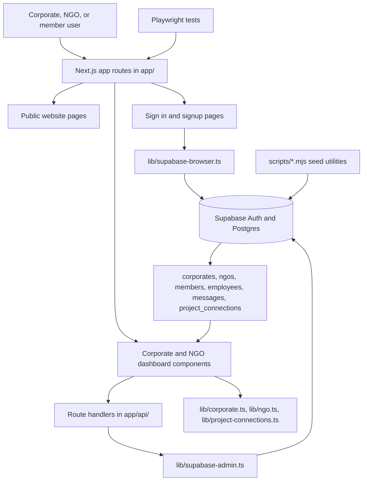
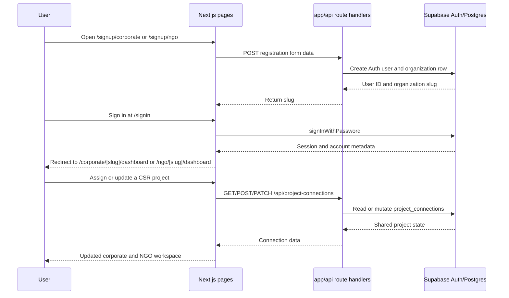

# CorpOgn

CSR and NGO collaboration platform for corporate social responsibility teams, NGO admins, and role-based field teams.

CorpOgn combines public marketing pages, corporate and NGO onboarding, authenticated dashboards, project assignment, fund tracking, reporting, and compliance workflows. It is built for CSR teams that need to discover and manage NGO partners, and for NGOs that need to manage proposals, documents, project delivery, utilization certificates, and impact reporting in one workspace.

## ✨ Features

- Public website pages for landing, platform, services, CSR strategy, CSR impact assessment, about, blog, contact, and privacy policy.
- Corporate registration and sign-in flows with slug-based dashboards at `/corporate/[slug]/dashboard`.
- NGO registration and sign-in flows with slug-based dashboards at `/ngo/[slug]/dashboard`.
- Corporate dashboard sections for analytics, campaign management, NGO management, project workspace, budgets, ESG impact, approvals, audit, employees, notifications, and support chat.
- NGO super-admin dashboard sections for command center, profile, compliance vault, trust score, AI proposal review, role assignment, project work, fund tracking, milestone reporting, impact reporting, utilization certificates, reports, audit logs, and settings.
- NGO member roles for finance officer, compliance officer, operations manager, field coordinator, reporting executive, and volunteer.
- Supabase-backed API routes for corporate and NGO registration, employees, members, messages, opportunities, funders, proposals, profile updates, project connections, utilization certificates, and impact reports.
- Shared `project_connections` workflow that lets corporates assign NGO projects and lets NGOs post progress updates back to the corporate workspace.
- Playwright end-to-end coverage for corporate dashboards, NGO dashboards, role dashboards, sign-in, locked/unlocked states, and dashboard navigation.

## 🏗️ Architecture

This is a Next.js 16 App Router application. Route segments live under `app/`, shared domain helpers and Supabase clients live under `lib/`, static assets live under `public/`, database setup lives in `supabase-schema.sql` and `supabase-production-migration.sql`, and Playwright tests live under `tests/`.

Client pages use `@supabase/ssr` through `lib/supabase-browser.ts` for browser authentication and reads. Server route handlers use the service-role Supabase client from `lib/supabase-admin.ts` for registration, account creation, project assignment, member creation, and dashboard mutations.



## 🚀 Getting started

### Prerequisites

- Node.js `>=20.0.0` as declared in `package.json`.
- npm, using the included `package-lock.json`.
- A Supabase project with Auth enabled and the schema from `supabase-schema.sql` applied.
- Playwright browser binaries for end-to-end tests.

### Installation

1. Install dependencies.

   ```bash
   npm install
   ```

2. Create `.env.local` in the project root with the Supabase values used by the browser and server clients. The exact required keys are listed in the configuration table below.

3. Apply the database schema in Supabase.

   Run the SQL from `supabase-schema.sql`, then run `supabase-production-migration.sql` in the same Supabase project.

4. Start the development server.

   ```bash
   npm run dev
   ```

5. Open the app.

   ```text
   http://localhost:3000
   ```

6. Optional: seed corporate employee demo accounts for the `corporate-giant` corporate record.

   ```bash
   npm run seed:corporate-employees
   ```

### Configuration

| Name | Required | Used by | Purpose |
| --- | --- | --- | --- |
| `NEXT_PUBLIC_SUPABASE_URL` | Yes | `lib/supabase-browser.ts`, `lib/supabase-admin.ts`, scripts | Supabase project URL for browser and server clients. |
| `NEXT_PUBLIC_SUPABASE_ANON_KEY` | Yes | `lib/supabase-browser.ts` | Public anon key for client-side Supabase auth and reads. |
| `SUPABASE_SERVICE_ROLE_KEY` | Yes | `lib/supabase-admin.ts`, scripts | Service-role key for server route handlers, admin Auth user creation, and seed scripts. |
| `.env.local` | Yes | Next.js and scripts | Local environment file read by Next.js and by seed scripts. |
| `playwright.config.ts` | Yes for tests | Playwright | Test projects, auth storage, dev server command, retries, and base URL. |

## 📖 Usage

The most common developer flow is to run the app, register or sign in as a corporate/NGO user, and use the dashboards to create shared CSR project state. The public routes start at `/`, sign-in is handled by `/signin`, corporate registration posts to `/api/corporates/register`, NGO registration posts to `/api/ngos/register`, and project assignment uses `/api/project-connections`.

Real API endpoint example for corporate registration:

```bash
curl -X POST http://localhost:3000/api/corporates/register \
  -F "companyName=Test Corporation 2026" \
  -F "companyEmail=csr-admin-2026@testcorp.example" \
  -F "workEmail=csr-admin-2026@testcorp.example" \
  -F "password=TestCorp@2026!" \
  -F "confirmPassword=TestCorp@2026!" \
  -F "industryType=Technology" \
  -F "state=Maharashtra" \
  -F "country=India" \
  -F "csrFocusAreas=Education"
```

Successful response:

```json
{
  "slug": "test-corporation-2026"
}
```

Main user flow:



Useful local routes:

- `/signin` - account-type-aware sign-in for corporate admins, corporate employees, NGO admins, and NGO members.
- `/signup/corporate` - corporate registration flow.
- `/signup/ngo` - NGO registration flow.
- `/corporate/[slug]/dashboard` - corporate CSR dashboard.
- `/ngo/[slug]/dashboard` - NGO dashboard.

## 🗂️ Project structure

```text
.
|-- app/                                      Next.js App Router pages, layouts, dashboards, and route handlers.
|   |-- api/                                  Server route handlers for registrations, members, messages, and projects.
|   |-- corporate/[slug]/dashboard/           Corporate dashboard route and UI component.
|   |-- ngo/[slug]/dashboard/                 NGO dashboard route and UI component.
|   |-- signup/                               Signup chooser plus corporate and NGO onboarding pages.
|   |-- signin/page.tsx                       Supabase sign-in page with demo account shortcuts.
|   |-- landing-frame.tsx                     Shared public-page frame.
|   |-- corpogn-content.tsx                   Landing/platform content components.
|   |-- layout.tsx                            Root app layout.
|   `-- globals.css                           Global Tailwind CSS styles.
|-- lib/                                      Shared Supabase clients and domain helpers.
|   |-- corporate.ts                          Corporate sidebar items and slug generation.
|   |-- ngo.ts                                NGO roles, permissions, project unlock items, and slug generation.
|   |-- project-connections.ts                Project connection types, defaults, mapping, and project naming.
|   |-- supabase-admin.ts                     Service-role Supabase client for server handlers.
|   `-- supabase-browser.ts                   Browser Supabase client for client components.
|-- public/                                   Static images, SVG feature assets, screenshots, and exported HTML references.
|-- scripts/                                  Seed and asset-generation scripts.
|   |-- seed-corporate-employees.mjs          Seeds corporate employee Auth users and rows.
|   |-- seed-ngo-test-data.mjs                Seeds NGO test data.
|   |-- seed-project-connection.mjs           Seeds shared corporate-NGO project data.
|   `-- generate-feature-svgs.mjs             Generates feature SVG assets.
|-- tests/                                    Playwright end-to-end specs and setup helpers.
|-- playwright/global-setup.ts                Creates/reuses NGO auth storage states for tests.
|-- playwright.config.ts                      Playwright projects and dev server configuration.
|-- supabase-schema.sql                       Base Supabase database schema.
|-- supabase-production-migration.sql         Production migration for project/reporting tables and fields.
|-- next.config.ts                            Next.js configuration.
|-- package.json                              Runtime versions, scripts, and dependencies.
`-- tsconfig.json                             TypeScript configuration.
```

## 🧪 Testing

Run linting:

```bash
npm run lint
```

Run the Playwright suite:

```bash
npx playwright test
```

`playwright.config.ts` starts `npm run dev` at `http://localhost:3000`, reuses an existing server when available, runs tests sequentially to avoid Supabase Auth rate limits, and writes the HTML report without opening it automatically. Coverage includes corporate sign-in, locked dashboard behavior, support-chat unlock, corporate navigation, dashboard content, corporate signup UI, NGO dashboard navigation, compliance vault uploads, NGO profile editing, trust score, AI proposal review, role assignment, member dashboards, and shared project workflows.

Playwright global setup signs in the Green Earth Foundation NGO admin and member demo accounts and stores sessions under `playwright/.auth/`. The corporate dashboard tests create a fresh corporate account through `POST /api/corporates/register`.

## 🤝 Contributing

1. Fork the repository.
2. Create a feature branch.
3. Install dependencies with `npm install`.
4. Make focused changes and keep them consistent with the existing App Router and Supabase patterns.
5. Run `npm run lint` and `npx playwright test` for affected flows.
6. Open a pull request with a concise description of the change and test results.

Before changing Next.js framework code, read the relevant local guide in `node_modules/next/dist/docs/`; this project uses Next.js `16.2.6`.

## 📄 License

No license file or `license` field is currently declared in this repository.
